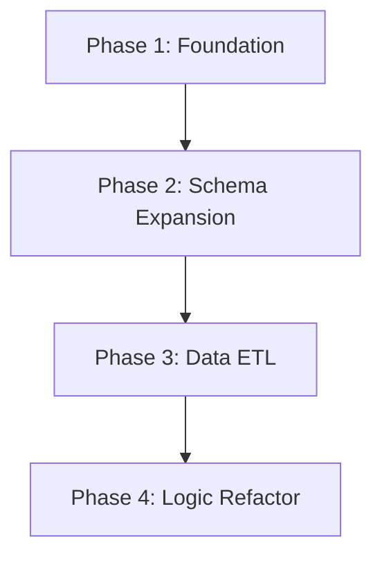

# Implementation Plan: PostgreSQL Migration & Schema Expansion (Phase 4.1)

This plan outlines the steps to migrate the Portfolio Tracker from SQLite to Supabase (PostgreSQL), introducing Alembic for migrations and expanding the schema for account silos.

## Plan Overview
- **Total Phases**: 4
- **Agents involved**: `data_engineer`, `coder`, `devops_engineer`
- **Estimated effort**: 4-6 hours

## Dependency Graph

## Execution Strategy Table
| Stage | Description | Agent | Execution Mode |
|-------|-------------|-------|----------------|
| 1 | Foundation & Dependencies | `devops_engineer` | Sequential |
| 2 | Schema Expansion (Alembic) | `data_engineer` | Sequential |
| 3 | Data ETL (SQLite -> PG) | `coder` | Sequential |
| 4 | Backend Refactor & Integration | `coder` | Sequential |

## Phase Details

### Phase 1: Foundation & Dependencies
**Objective**: Prepare the environment for PostgreSQL and initialize Alembic.
**Agent**: `devops_engineer` (Rationale: Focus on environment setup and tool configuration.)

**Files to Modify**:
- `backend/requirements.txt`: Add `psycopg2-binary` and `alembic`.
- `backend/app/database.py`: Update engine creation logic to handle PostgreSQL URLs and remove SQLite-specific `connect_args` for non-SQLite connections.

**Implementation Details**:
- Initialize Alembic: `cd backend; alembic init alembic`.
- Configure `backend/alembic.ini` to use the Supabase URL (provided by user).
- Configure `backend/alembic/env.py` to import `Base` from `app.models`.

**Validation**:
- `pip install -r backend/requirements.txt` succeeds.
- `alembic current` runs without error (showing no migrations yet).

**Dependencies**: None

---

### Phase 2: Schema Expansion (Alembic)
**Objective**: Update models and generate the first cloud migration.
**Agent**: `data_engineer` (Rationale: Specialized in schema design and SQLAlchemy models.)

**Files to Modify**:
- `backend/app/models.py`: 
    - Define `AccountType` (Enum: `ISA`, `OVERSEAS`, `PENSION`).
    - Add `account_type` column to `Asset` and `Transaction` models.
    - Define `VXNHistory` and `MSTRCorporateAction` tables.

**Implementation Details**:
- Update `Asset` model: `account_type = Column(Enum(AccountType), default=AccountType.OVERSEAS)`.
- Create `VXNHistory`: `date` (Date, PK), `close` (Float).
- Create `MSTRCorporateAction`: `date` (Date, PK), `btc_holdings` (Float), `outstanding_shares` (Float).
- Generate migration: `alembic revision --autogenerate -m "Initial PG Schema"`.
- Apply migration: `alembic upgrade head`.

**Validation**:
- Tables are visible in the Supabase Dashboard.
- `alembic history` shows the new revision.

**Dependencies**: blocked_by: [1]

---

### Phase 3: Data ETL (SQLite -> PG)
**Objective**: Transfer existing records from `portfolio.db` to Supabase.
**Agent**: `coder` (Rationale: Requires writing logic to map and transfer records between two database sessions.)

**Files to Create**:
- `backend/scripts/migrate_sqlite_to_pg.py`: ETL script using two SQLAlchemy engines (one for local SQLite, one for Supabase).

**Implementation Details**:
- Script should:
    1. Read all `Asset` records from SQLite.
    2. Write them to Supabase (defaulting `account_type` to `OVERSEAS`).
    3. Read all `Transaction` records from SQLite.
    4. Write them to Supabase (mapping the old `asset_id` to the new PostgreSQL `asset_id`).
- Use transactions to ensure atomic transfer.

**Validation**:
- `python backend/scripts/migrate_sqlite_to_pg.py` prints success for each table.
- Verify row counts in Supabase match the counts in local SQLite.

**Dependencies**: blocked_by: [2]

---

### Phase 4: Backend Refactor & Integration
**Objective**: Clean up redundant code and finalize the switch to PostgreSQL.
**Agent**: `coder` (Rationale: High-impact changes to the core API and helper scripts.)

**Files to Modify**:
- `backend/app/database.py`: Export a unified `get_db` dependency.
- `backend/app/main.py`: Remove redundant `get_db` and `Base.metadata.create_all` (since we use Alembic now).
- `check_bond.py` & `delete_duplicate.py`: Update to use SQLAlchemy/PostgreSQL syntax instead of `sqlite3`.

**Implementation Details**:
- Remove `connect_args={"check_same_thread": False}` for PostgreSQL connections.
- Ensure all endpoints in `main.py` import `get_db` from `app.database`.

**Validation**:
- `uvicorn backend.app.main:app` starts and serves `/api/portfolio/summary` from Supabase data.
- Dashboard shows the migrated Brazil Bond data.

**Dependencies**: blocked_by: [3]

## File Inventory
| File | Action | Phase | Purpose |
|------|--------|-------|---------|
| `backend/requirements.txt` | Modify | 1 | New dependencies. |
| `backend/app/database.py` | Modify | 1, 4 | PG support and unified `get_db`. |
| `backend/app/models.py` | Modify | 2 | Schema expansion (Enums, Signal tables). |
| `backend/scripts/migrate_sqlite_to_pg.py` | Create | 3 | One-time data transfer. |
| `backend/app/main.py` | Modify | 4 | Dependency cleanup. |

## Risk Classification
- Phase 1: LOW (Standard configuration).
- Phase 2: MEDIUM (Strictness of PG types).
- Phase 3: HIGH (Crucial data transfer; risk of ID mismatch).
- Phase 4: MEDIUM (Core API changes).

## Execution Profile
- Total phases: 4
- Parallelizable phases: 0
- Sequential-only phases: 4
- Estimated sequential wall time: ~4-5 turns per phase

Note: Native parallel execution is not used for this migration to prevent race conditions during schema updates.
